# ProxyPilot

**Per-App Proxy Manager for macOS**

ProxyPilot gives individual applications their own proxy configuration — without a TUN
device, without touching your system-wide proxy settings, without root, and without
injecting anything into the target app.

Point Codex at `127.0.0.1:7890`, leave Chrome on DIRECT, and route Terminal over a
SOCKS5 proxy. Everything else on the machine stays exactly as it was.

---

## Features

| Area | What you get |
| --- | --- |
| **Per-app proxy** | Assign an HTTP / HTTPS / SOCKS5 profile to each app, or set it to DIRECT. |
| **Launch strategies** | Chromium (`--proxy-server`), Environment (`HTTP_PROXY` / `HTTPS_PROXY` / `ALL_PROXY`), and DIRECT. |
| **Automatic detection** | Reads the bundle's Frameworks and `app.asar` to decide whether an app understands Chromium proxy arguments. |
| **Transparent proxy** | A `NETransparentProxyProvider` system extension intercepts *any* app's TCP by bundle ID — apps that ignore both Chromium args and env vars are still routed. Rules miss → system direct. |
| **Real proxy testing** | Level 1 TCP connect with latency, Level 2 a real HTTPS request *through* the proxy. A port being open is not treated as proof. |
| **Restart handling** | Never silently kills an app. Shows **Restart Required**, asks before restarting, and needs a second confirmation to force quit. |
| **Master switch** | One switch gates every proxy launch. Turning it off warns about apps that are still running with proxy settings. |
| **Menu bar panel** | Per-app switches, Enable All / Disable All, tools and quit — always one click away. |
| **Bypass lists** | Per-app bypass entries emitted as `NO_PROXY` *and* Chromium's `--proxy-bypass-list`. |
| **Keychain credentials** | Proxy passwords live in the macOS Keychain. Never in JSON, `UserDefaults`, or the log. |
| **Diagnostics** | Every launch decision, argument, environment and proxy test, with sensitive values redacted. |

## Logo


The mark is one route arriving and two routes leaving — the same idea as the product:
each application gets its own path out.

It is **drawn, not drawn by hand in a design tool**, and it is reproducible from source:

```bash
swift tools/GenerateAppIcon.swift
```

That single command writes all ten app-icon PNGs, the asset-catalog `Contents.json`
files, the sidebar brand mark, and the reference images in `docs/logo/`.

The shape was derived from Apple's own icons rather than guessed:

| Property | Value | How it was determined |
| --- | --- | --- |
| Artwork square | 824 / 1024 = **0.8047** | Measured the opaque bounds of a system app icon at a 50% coverage threshold — which lands exactly on Apple's documented 824pt square. |
| Corner curve | span **0.2605**, tangent **0.672** | A cubic Bézier corner fitted to the measured edge profile of that icon (RMSE 0.002). A circular arc would need a tangent factor of 0.4477, so the real corner is appreciably fuller. |
| Stroke / head | — | The shaft ends exactly one cap-radius before the head's base, so the round cap lands flush on the base plane. Any other offset produces a visible step where the narrow shaft meets the wide head. |

Sizes ramp, rendered directly at each target resolution rather than downscaled from one
bitmap, with a bolder and wider mark below 32pt so it survives in the Dock and in Finder
list views:

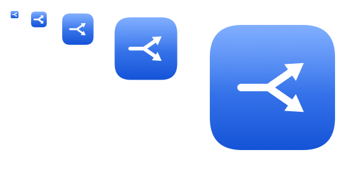

The sidebar and the menu bar panel both use the real logo:

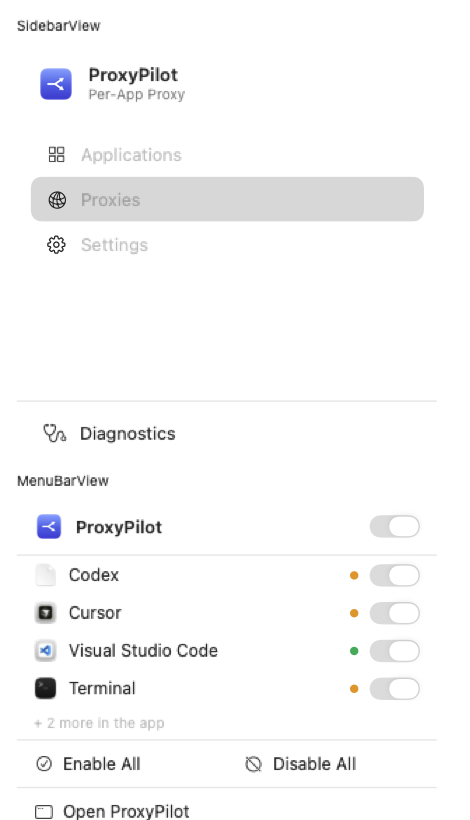

### Simplified Chinese

The interface ships with a complete Simplified Chinese translation and follows the
system language automatically — nothing to configure.

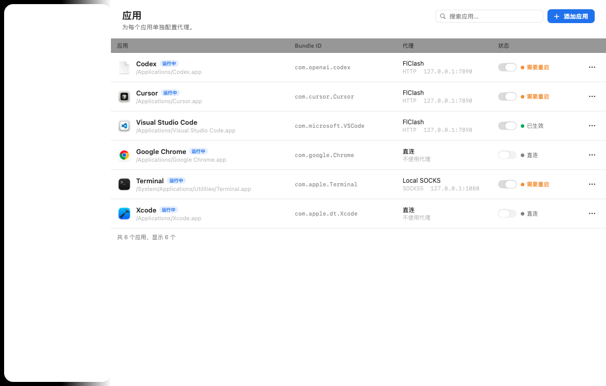

A few things are deliberately **not** translated, because translating them would break
them: Diagnostics log bodies, log category and level names, protocol names
(`HTTP` / `SOCKS5` / `DIRECT`), environment variable names, and Clash-style rule
keywords (`PROXY` / `DIRECT` / `BLOCK`).

To force a language for development, `Localized.localeOverride` plus
`Environment(\.locale)` switch every string in the app; the snapshot suite renders the
main screens in both languages so a missing key shows up as English text sitting in an
otherwise Chinese layout.

The menu bar **extra** uses the `arrow.triangle.branch` SF Symbol instead of the colour
logo, because macOS menu bar items must be monochrome templates that adapt to light and
dark menu bars.

## Screenshots

Applications — the main screen.

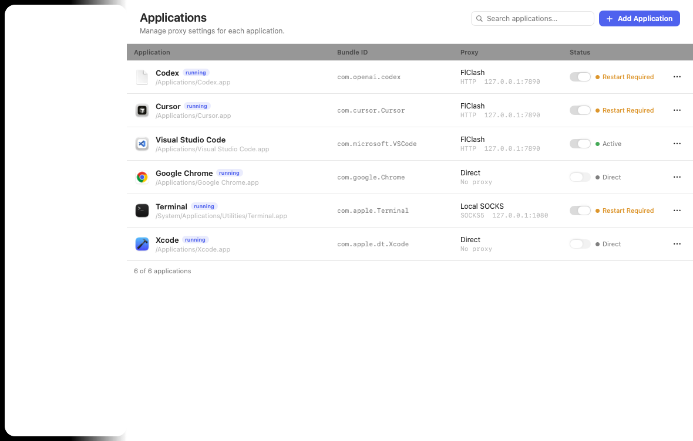

Application detail — proxy assignment, launch mode, bypass list and compatibility matrix.

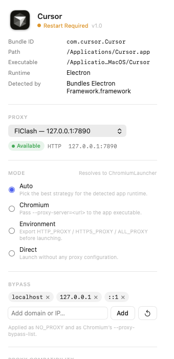

Proxies — profiles and the inline editor with a real connection test.

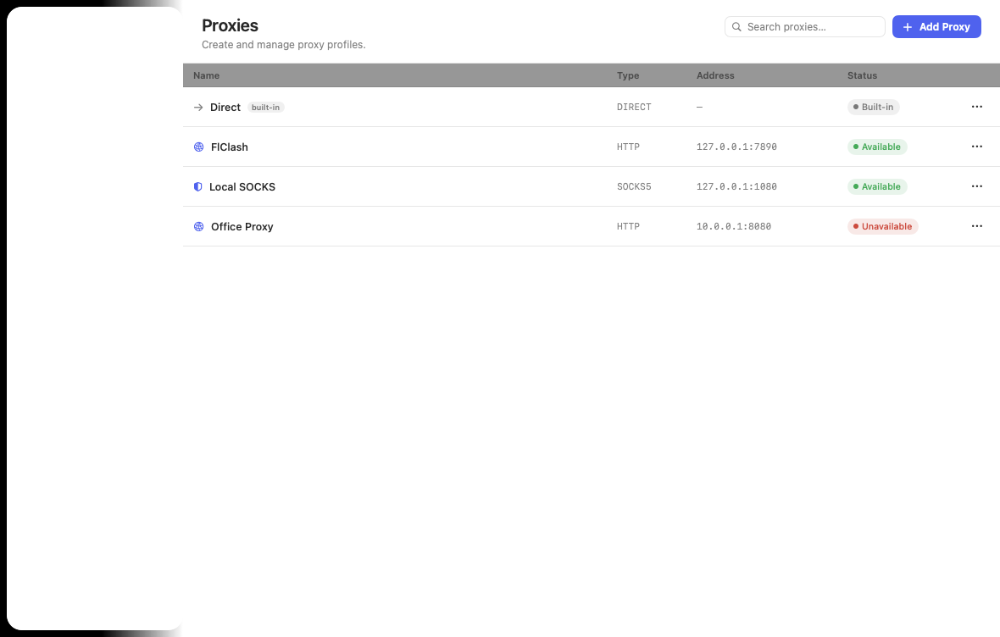
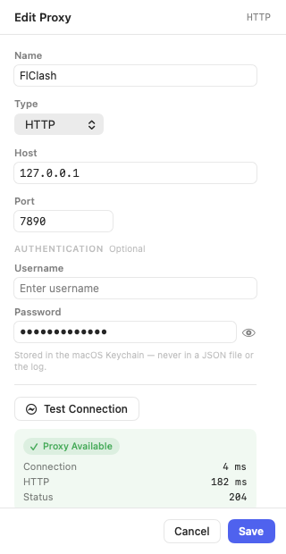

Menu bar panel, Settings and Diagnostics.

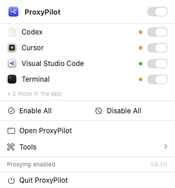
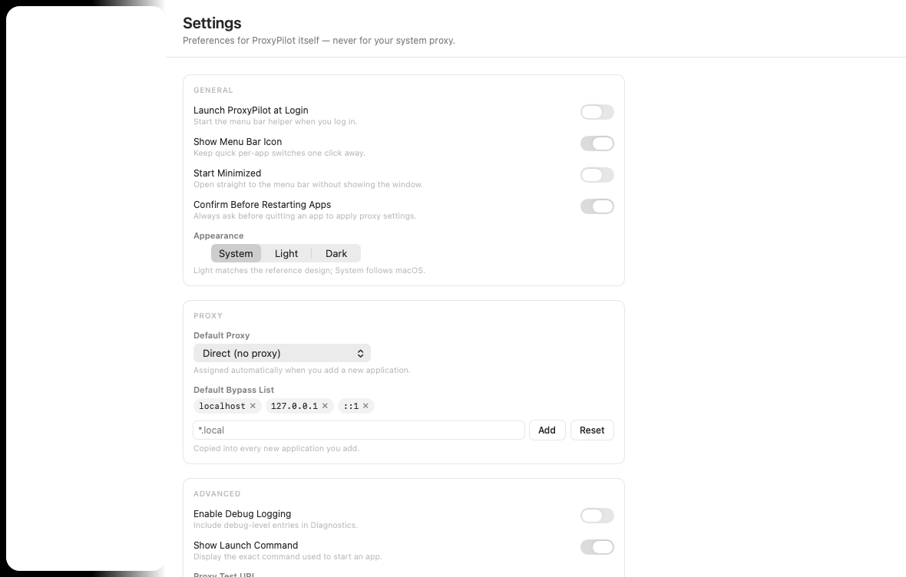
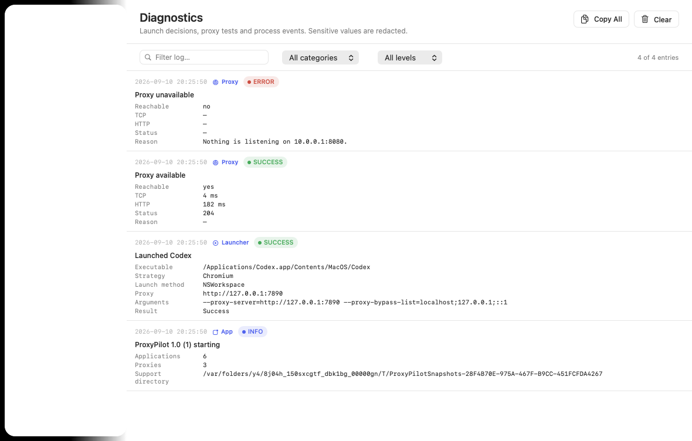

ProxyPilot follows the system appearance. The reference design is light; dark mode is
fully supported (and can be pinned from **Settings → Appearance**).

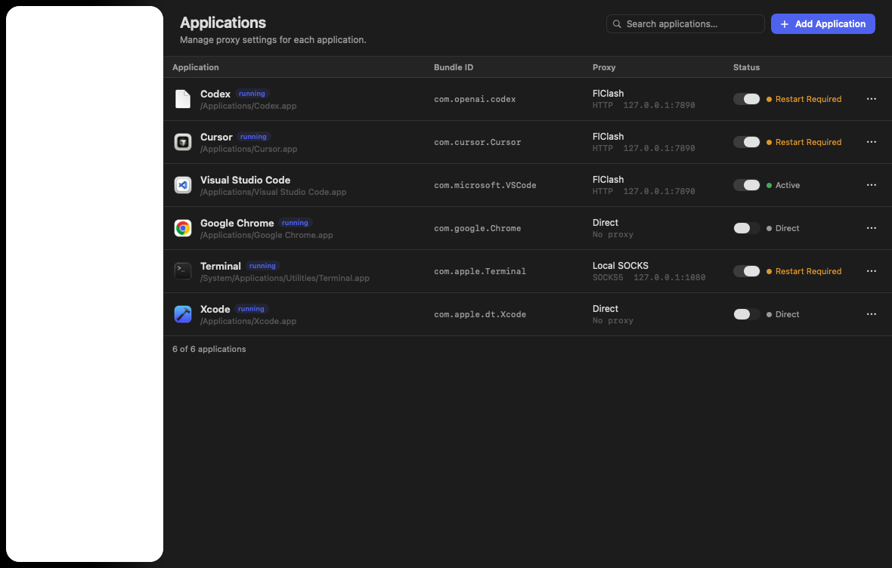

## Requirements

- macOS 14.0 or later
- Xcode 16 or later (built and verified with Xcode 26.3 / Swift 6.2)
- A local proxy that speaks HTTP or SOCKS5 (Clash, FlClash, mihomo, sing-box, …)

ProxyPilot is **not sandboxed**. That is deliberate: the sandbox forbids launching other
applications with a custom environment and forbids terminating them. The app still runs
without root, without `sudo`, and with the hardened runtime enabled.

## Installation

```bash
git clone <this repository>
cd managerproxy
xcodebuild -scheme managerproxy -configuration Release build
```

Then copy the built `ProxyPilot.app` from `DerivedData` into `/Applications` and launch it.
Launch-at-login requires the app to live in `/Applications` and to be code signed.

## Quick Start

1. Launch ProxyPilot. On first run it scans `/Applications`, `~/Applications` and
   `/System/Applications`, and offers the well-known developer apps it finds.
2. Open **Proxies** and add your local proxy — for example `FlClash`, HTTP,
   `127.0.0.1`, `7890`. Press **Test Connection** to confirm it works.
   HTTP and SOCKS5 profiles both default to port **7890**, because Clash-style
   `mixed` ports serve both protocols at once.
3. Back on **Applications**, pick a proxy profile for an app and flip its switch on.
4. If the app is already running, ProxyPilot asks to restart it. Accept, and the app
   relaunches with the proxy applied — nothing else on the system changes.

### Codex example

```text
Codex Desktop → FlClash (HTTP 127.0.0.1:7890)
```

ProxyPilot launches:

```bash
HTTP_PROXY=http://127.0.0.1:7890 \
HTTPS_PROXY=http://127.0.0.1:7890 \
ALL_PROXY=http://127.0.0.1:7890 \
NO_PROXY=localhost,127.0.0.1,::1 \
/Applications/Codex.app/Contents/MacOS/Codex \
  --proxy-server=http://127.0.0.1:7890 \
  --proxy-bypass-list=localhost;127.0.0.1;::1
```

The executable path comes from `CFBundleExecutable` — it is never hard-coded. The exact
command is shown in the app detail pane (**Settings → Show Launch Command**).

### Cursor example

Cursor ships Electron, so ProxyPilot detects it and uses the Chromium strategy
automatically with `--proxy-server` plus the proxy environment variables.

### HTTP proxy

```text
HTTP_PROXY   = http://127.0.0.1:7890
HTTPS_PROXY  = http://127.0.0.1:7890
ALL_PROXY    = http://127.0.0.1:7890
```

### SOCKS5 proxy

```text
ALL_PROXY = socks5://127.0.0.1:7890
```

> **Prefer the HTTP profile for Chromium and Electron apps** (Chrome, Edge, VS Code,
> Cursor, Codex…). Chromium resolves DNS *locally* for `socks5://`, so a poisoned or
> fake-IP answer travels straight to the proxy. An HTTP proxy issues `CONNECT` with the
> hostname, letting the proxy resolve it remotely. ProxyPilot shows this warning in the
> application detail pane when you assign a SOCKS5 profile to a Chromium app.

Both cases are set in upper and lower case, because tools disagree about which one they
honour.

### Transparent proxy (Phase 2)

Phase 1 only works for apps that honour Chromium arguments or proxy environment
variables. For everything else there is the **Transparent Proxy** system extension:

1. Open **Settings → Transparent Proxy** and turn on the master switch. ProxyPilot
   submits the system-extension activation request and automatically opens
   **System Settings → Privacy & Security**, where macOS shows an **Allow** button
   for the extension. Approve it there — this one-time approval is required.
   (After approval the extension also appears under **General → Login Items &
   Extensions → Network Extensions**, but the *Allow* button lives in Privacy &
   Security.)
2. Back on **Applications**, pick a proxy profile for an app and flip both its switches
   on (or just the **Transparent Proxy** one).
3. The next time that app opens a TCP connection, the system hands the flow to
   ProxyPilot's extension, which looks up the app's bundle ID in
   `group.proxypilot/transparent-rules.json` and relays it through the assigned proxy
   (HTTP CONNECT or SOCKS5, credentials from the shared keychain). Apps with no rule are
   passed back to the system and connect **directly** — nothing else on the machine is
   affected.

The extension applies the current rule set live: ProxyPilot rewrites
`transparent-rules.json` in the App Group container whenever profiles, per-app
assignments or the master switch change, and the extension reloads on file change and on
a distributed notification.

Phase 2 v1 proxies **TCP only**; UDP and DNS fall through to the system untouched.

### Testing a specific domain

The proxy test URL is not limited to a health-check endpoint. Point **Settings →
Proxy Test URL** at whatever the app actually needs and the result tells you whether
that domain is reachable *through the selected node*:

```text
https://chatgpt.com/backend-api/models     -> 403 means the node is blocked by the site
https://api.openai.com/v1/models           -> 401 means reachable (401 = needs auth)
```

A 403 here is the single most common reason an app "has a proxy but still doesn't work":
the proxy connected fine, but the exit node is refused by the target site. Switching
nodes in your proxy client fixes it.

### Bypass

The default bypass list is `localhost`, `127.0.0.1`, `::1`. Add anything you like
(`*.local`, `10.0.0.0/8`, an internal host) per app. It is emitted as `NO_PROXY` for
environment launches and as `--proxy-bypass-list` for Chromium launches.

## Limitations

> Phase 1 cannot transparently proxy arbitrary macOS applications. Applications must
> support Chromium proxy arguments or conventional proxy environment variables.

Phase 2 fixes that with the transparent proxy system extension, with these remaining
limits:

- **TCP only in v1.** UDP and DNS are not proxied; they are passed through to the system.
- The system extension must be approved once in **System Settings → General → Login
  Items & Extensions**. Until it is approved, the master switch shows **Waiting for
  system approval** and no traffic is intercepted.
- The extension is activated on demand by the system when a matched app opens a
  connection; the first matched connection can add a short startup latency.
- Existing connections are unaffected. **Enable** means "the next time this app connects,
  use this configuration".
- Code signing, notarisation and Developer ID distribution are out of scope for this
  build (an Apple Development build only runs on this team's machines; App Group
  `group.proxypilot` is not registered in the Developer portal, so any re-provisioning
  that consults the portal for capabilities — e.g. `-allowProvisioningUpdates` — can
  fail; a plain local `xcodebuild build` works).

## Architecture

```text
ProxyPilot.app
├── UI            SwiftUI, NavigationSplitView + MenuBarExtra
├── Application Manager   AppScanner / AppDetector
├── Proxy Manager         ProxyProfile CRUD + Keychain
├── Launcher Engine       Chromium / Environment / Direct
├── Transparent Proxy     TransparentProxyController (activation, rule sync)
├── Proxy Tester          TCP connect + real HTTP probe
├── Process Manager       graceful terminate, force quit
└── Persistence           Codable + JSON in Application Support
└── (embedded) com.proxypilot.mac.TransparentProxy.systemextension
    └── NETransparentProxyProvider · TCPRelay (HTTP CONNECT / SOCKS5)
```

```text
ProxyPilot/
├── ProxyPilotApp.swift          @main · window + menu bar scenes
├── App/
│   └── AppState.swift           single source of truth, status derivation
├── Models/                      ManagedApplication, ProxyProfile, ProxyRule, AppSettings
├── Services/                    AppScanner, AppDetector, ProxyTester, ProcessManager,
│                                PersistenceService, KeychainService,
│                                TransparentProxyController
├── Launchers/                   AppLaunching, LaunchPlan(+Builder), LauncherEngine,
│                                Chromium/Environment/Direct launcher
├── Utilities/                   KnownApplications, Log, Theme, ProxyPilotError
├── Views/                       MainView, SidebarView, Applications/, Proxies/,
│                                Settings/, MenuBar/, Components/
├── Shared/                      TransparentConstants, TransparentRules, SharedKeychain
└── ProxyPilotTransparentProxy/  TransparentProxyProvider, TCPRelay, main, Info.plist,
                                 entitlements

tools/GenerateAppIcon.swift      draws the logo and every icon size
ProxyPilotTests/                 unit tests + the offscreen snapshot suite
```

State files live in `~/Library/Application Support/ProxyPilot/`, plus the App Group
container `group.proxypilot` holds `transparent-rules.json` (bundle ID → proxy type,
host, port, keychain account key). Secrets themselves never leave the Keychain: both
processes share it through access group `37AGF843SG.group.proxypilot`.

`LaunchPlanBuilder` is deliberately a set of pure functions so the entire launch decision
— proxy URL, environment, `NO_PROXY`, Chromium arguments — is unit-testable without
starting a process. The system extension mirrors that spirit: the rule file is a plain
JSON model (`TransparentRules.swift`) shared by both targets and written atomically.

## Security

- No root, no `sudo`, no privileged helper.
- No TUN device, no virtual interface.
- No SIP modification, no binary injection, no `DYLD_INSERT_LIBRARIES`.
- No modification of target app bundles.
- `networksetup -setwebproxy` / `-setsocksfirewallproxy` are never called, and the
  SystemConfiguration system proxy is never touched.
- Quitting ProxyPilot leaves other applications untouched. Launched apps are independent
  processes, not children of ProxyPilot.
- Loader and host-debug environment variables (`DYLD_*`, `__XCODE*`, `XCODE_*`, …) are
  stripped from the environment handed to a launched app, so ProxyPilot can never
  accidentally inject into the target.
- Proxy passwords go to the Keychain; the JSON files only ever contain a lookup key.
- Log values whose key looks sensitive (`password`, `token`, `credential`, `secret`,
  `authorization`) are redacted before they are stored.
- The transparent proxy runs inside a system extension sandbox: it can only read its own
  App Group container and the shared keychain, and it is on-demand activated by macOS —
  no continuous background footprint.
- A flow whose app has no rule is returned to the system (`handleNewFlow` → `false`) and
  connects directly; the extension never sees another app's payload beyond the connect
  metadata needed to route it.

## Build From Source

```bash
# Regenerate the logo and all app-icon assets (only needed after editing the geometry)
swift tools/GenerateAppIcon.swift

# Build the app (builds and embeds the system extension too)
xcodebuild -scheme managerproxy -configuration Debug build

# Run the test suite (108 tests)
xcodebuild -scheme managerproxy -configuration Debug test

# Run only the non-visual tests — the snapshot suite briefly opens windows
xcodebuild -scheme managerproxy -configuration Debug test \
  -skip-testing:ProxyPilotTests/SnapshotTests
```

Signing note: the app and the `ProxyPilotTransparentProxy` system extension are signed
with the team's automatic **Mac Team Provisioning Profile** (team `37AGF843SG`), which
carries the full `networkextension` capability set and the `group.proxypilot` App Group.
Do **not** pass `-allowProvisioningUpdates`: it consults the Developer portal, where
`group.proxypilot` is not registered, and fails. Plain local builds are unaffected.

The `SnapshotTests` suite rasterises every screen to `/tmp/proxypilot-shots` so the layout
can be reviewed. It needs a window server and will flash windows on screen; use
`-skip-testing` in headless environments.

## Roadmap

**Phase 1 — shipped.** Per-app proxying through Chromium arguments and environment
variables, proxy testing, restart handling, menu bar, persistence, Keychain, diagnostics.

**Phase 2 — shipped.** Transparent proxy via a `NETransparentProxyProvider` system
extension: any app's TCP flows are intercepted by bundle ID and relayed through its
assigned HTTP/SOCKS5 proxy; un-routed apps are passed back to the system to connect
directly. UDP/DNS currently pass through; per-app UDP proxying (a second
`NEPacketTunnelProvider` or filter-based redirect) is a possible follow-up.

**Phase 3 — Advanced rules.** `DOMAIN`, `DOMAIN-SUFFIX`, `IP`, `CIDR`, `PROCESS`,
`BUNDLE-ID` and `PORT` matching with `PROXY` / `DIRECT` / `BLOCK` actions. The
`ProxyRule` model already exists and is persisted; only the matching engine is deferred.

**Phase 4 — Traffic monitor.** Per-app throughput and live connection lists.
